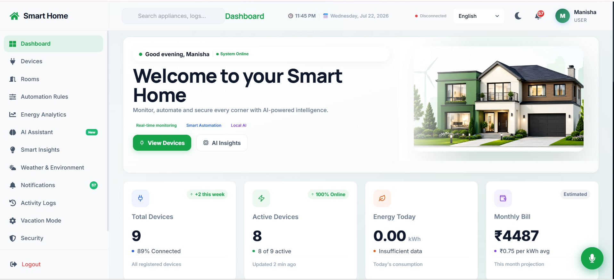
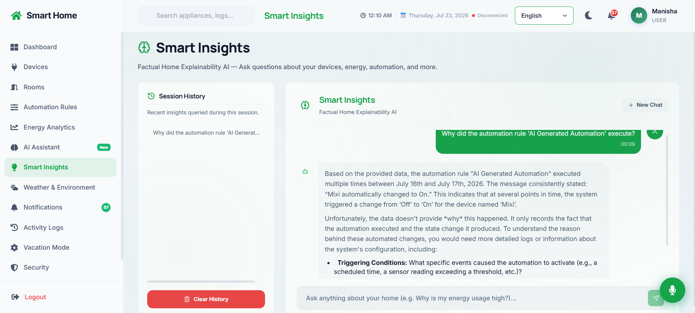
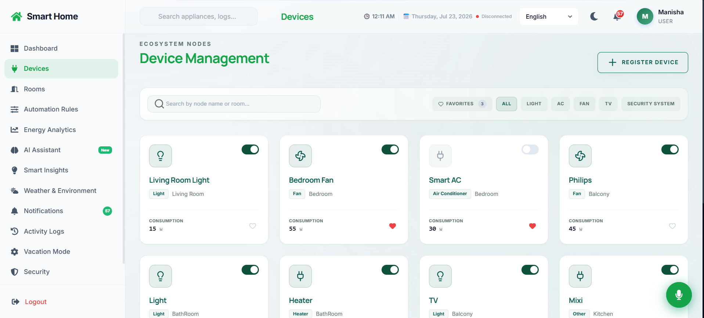
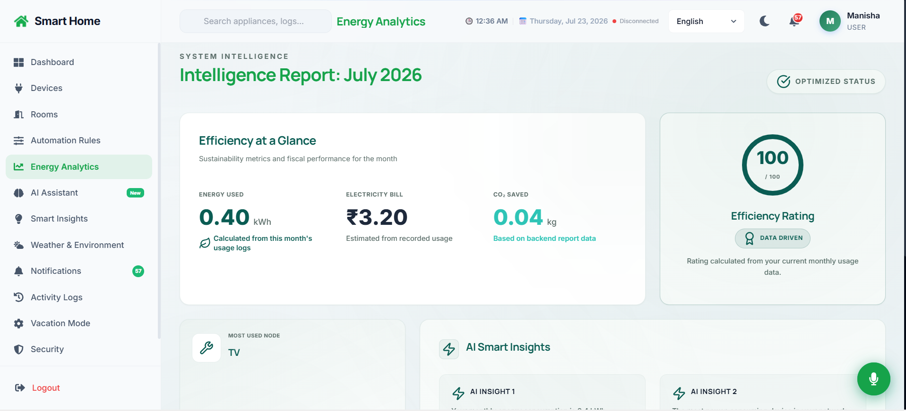
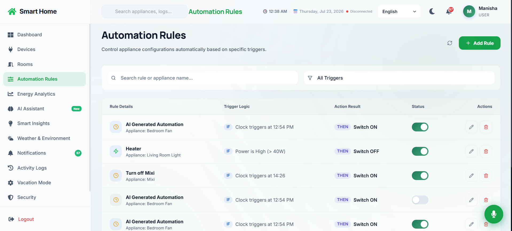
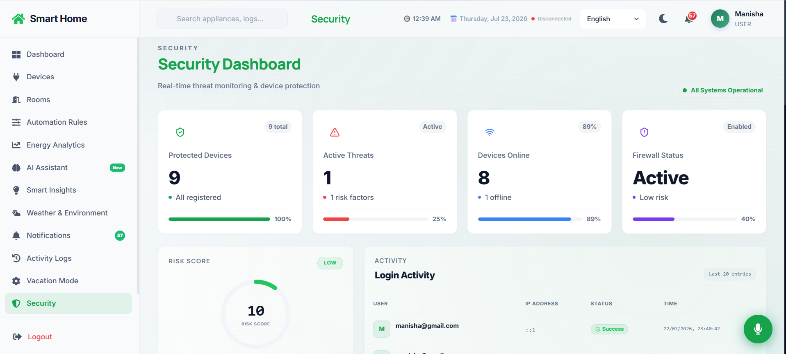
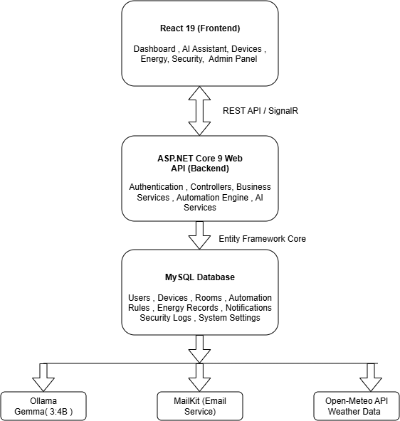

# Smart Home Automation System

> **DTN28 Internship Project – Full Stack DotNet (React + ASP.NET Core 9) with AI Integration**

**Status:** Under Active Development

---

## Overview

The Smart Home Automation System is an AI-powered platform developed as part of the **DTN28 Internship Project**. It provides a centralized dashboard for monitoring, controlling, and automating smart home devices while integrating Artificial Intelligence for intelligent decision-making and user assistance.

The application combines real-time communication, energy analytics, automation, predictive maintenance, security monitoring, multilingual support, and AI-powered recommendations to provide an efficient smart home management solution.

> **Note:** This project is currently under development. Core functionalities have been implemented, while additional features, optimizations, testing, and IoT integrations are planned for future releases.

---

## Features

- AI-powered Smart Home Assistant
- Device & Room Management
- Energy Analytics Dashboard
- Automation Rules Engine
- Security Monitoring
- Real-time Notifications
- Predictive Maintenance
- Weather Integration
- Multi-language Support
- Voice Command Processing
- Admin Management Panel

---

## Application Screenshots

### Dashboard



---

### AI Assistant



---

### Device Management



---

### Energy Analytics



---

### Automation Rules



---

### Security Dashboard



---

### System Architecture



---

## Technology Stack

### Frontend

- React 19
- Tailwind CSS
- React Router
- Axios
- Recharts
- Framer Motion
- SignalR Client
- i18next
- Lucide React

### Backend

- ASP.NET Core 9 Web API
- Entity Framework Core
- MySQL
- JWT Authentication
- BCrypt.Net
- SignalR
- Ollama
- Gemma 3:4B
- MailKit
- Open-Meteo API

### Development Tools

- Visual Studio 2022
- Visual Studio Code
- Git & GitHub
- Postman

---

## AI Integration

The application integrates the **Gemma 3:4B** Large Language Model through **Ollama** to provide intelligent smart home assistance.

### AI Capabilities

- Natural Language Assistant
- Smart Device Control
- AI-generated Reports
- Energy Optimization Recommendations
- Routine Learning
- Predictive Maintenance
- Security Risk Analysis
- Multilingual Assistance

---

## Repository Structure

```text
Smart-Home-Automation
│
├── SmartHomeAutomation/
│   └── ASP.NET Core 9 Web API
│
├── smart-home-frontend/
│   └── React 19 Application
│
├── Images/
│   ├── dashboard.png
│   ├── ai-assistant.png
│   ├── automation.png
│   ├── device-management.png
│   ├── energy-dashboard.png
│   ├── security-dashboard.png
│   └── architecture.png
│
└── README.md
```

---

## Getting Started

### Clone the Repository

```bash
git clone https://github.com/Manisha5918/Smart-Home-Automation.git
```

### Backend

```bash
cd SmartHomeAutomation

dotnet restore

dotnet run
```

Swagger UI:

```
https://localhost:7292/swagger
```

### Frontend

```bash
cd smart-home-frontend

npm install

npm run dev
```

---

## Key Modules

- Dashboard
- Device & Room Management
- Energy Analytics
- Automation Rules Engine
- AI Assistant
- Security Monitoring
- Predictive Maintenance
- Notifications
- Weather Integration
- Voice Command Processing
- Admin Management

---

## Security

- JWT Authentication
- Role-Based Authorization
- BCrypt Password Hashing
- Secure REST APIs
- Real-time Security Notifications

---

## Future Enhancements

The project is under active development. Planned enhancements include:

- Responsive mobile interface
- Cloud deployment (Azure / AWS)
- Docker support
- MQTT-based IoT device integration
- Enhanced AI capabilities
- Advanced energy analytics
- Smart camera integration
- Two-factor authentication (2FA)
- Progressive Web App (PWA)
- CI/CD pipeline
- Unit and integration testing
- Performance optimization

---

## Developer

**Manisha G**


---

## Project Status

This project is part of the **DTN28 Internship Project** and is currently under active development. Additional features, documentation, testing, and performance improvements will be implemented in future updates.
